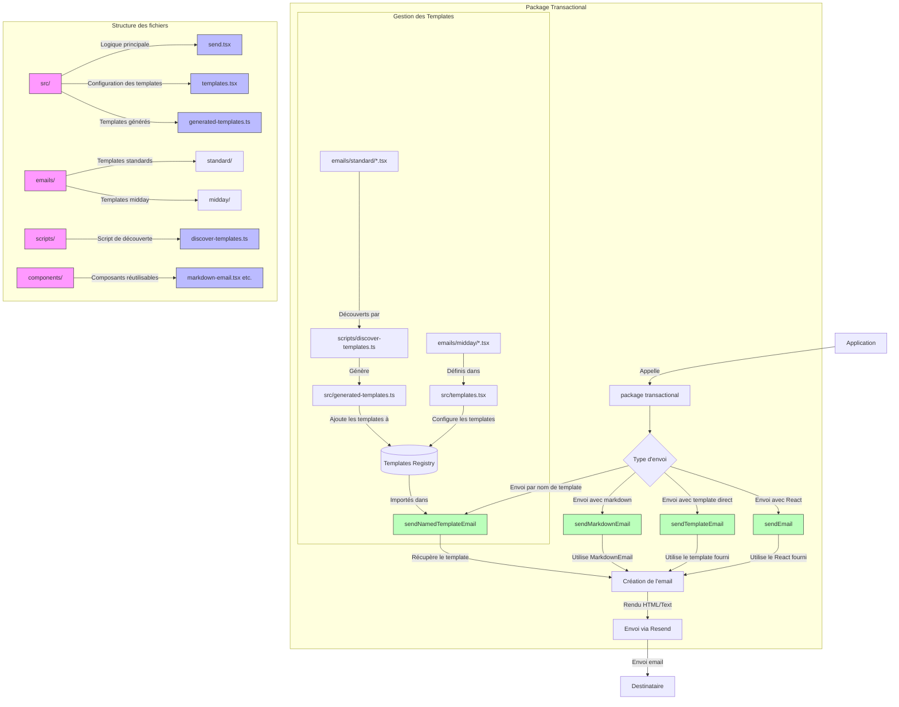

# Package Transactional Emails

Ce package fournit un système flexible et typé pour l'envoi d'emails transactionnels en utilisant React Email et Resend.

## Fonctionnalités

- **Système de templates typés** : Tous les templates d'emails sont fortement typés avec TypeScript
- **Envoi d'emails simplifié** : Envoyez des emails en spécifiant simplement le nom du template et ses props
- **Découverte automatique de templates** : Ajoutez facilement de nouveaux templates sans avoir à modifier manuellement les imports
- **Fonctions d'envoi génériques** : Créez rapidement des fonctions d'envoi pour de nouveaux templates

## Structure du projet

```text
packages/transactional/
├── components/           # Composants réutilisables pour les emails
├── emails/               # Templates d'emails
│   ├── midday/           # Templates spécifiques à Midday
│   │   ├── welcome.tsx
│   │   ├── invite.tsx
│   │   └── ...
│   ├── password-reset.tsx
│   ├── invite.tsx
│   └── welcome.tsx
├── scripts/              # Scripts utilitaires
│   └── discover-templates.ts  # Script pour découvrir automatiquement les templates
├── src/
│   ├── client.ts         # Configuration du client Resend
│   ├── send.tsx          # Fonctions d'envoi d'emails
│   ├── templates.tsx     # Définition des templates et de leurs types
│   └── utils/            # Utilitaires
│       └── template-discovery.ts  # Fonctions pour découvrir les templates
└── README.md
```

## Architecture du système

Le diagramme ci-dessous illustre l'architecture et le flux de données du package transactional :



## Comment utiliser

### Envoyer un email avec un template existant

```typescript
import { sendNamedTemplateEmail } from '@/packages/transactional/src/send';

// Envoi d'un email en utilisant un template nommé
await sendNamedTemplateEmail({
  to: 'user@example.com',
  templateName: 'midday-welcome',
  props: {
    fullName: 'John Doe'
  },
  subject: 'Bienvenue chez Midday !', // Optionnel, un sujet par défaut sera utilisé si non fourni
  test: process.env.NODE_ENV !== 'production' // Optionnel
});

// Utilisation d'une fonction d'envoi spécifique
import { sendMiddayWelcomeEmail } from '@/packages/transactional/src/send';

await sendMiddayWelcomeEmail({
  to: 'user@example.com',
  props: {
    fullName: 'John Doe'
  }
});
```

### Ajouter un nouveau template

1. Créez un nouveau fichier `.tsx` dans le dossier approprié (par exemple `emails/midday/new-template.tsx`)
2. Exécutez le script de découverte de templates pour générer automatiquement le code nécessaire :

```bash
npx tsx packages/transactional/scripts/discover-templates.ts
```

1. Mettez à jour les interfaces de props dans le fichier généré (`src/generated-templates.ts`)
2. Importez les nouveaux templates dans `templates.tsx` et ajoutez-les à l'objet `emailTemplates`

### Créer une fonction d'envoi pour un nouveau template

```typescript
import { createMiddayEmailSender } from '@/packages/transactional/src/send';

// Créer une fonction d'envoi pour un template spécifique
export const sendNewTemplateEmail = createMiddayEmailSender('midday-new-template');
```

## Bonnes pratiques

1. **Toujours utiliser des types forts** : Assurez-vous que tous les templates ont des interfaces de props bien définies
2. **Utiliser les fonctions génériques** : Préférez `sendNamedTemplateEmail` ou les fonctions créées avec `createMiddayEmailSender` plutôt que de créer des fonctions d'envoi manuellement
3. **Ajouter des sujets par défaut** : Mettez à jour la fonction `getDefaultSubject` dans `send.tsx` lorsque vous ajoutez un nouveau template
4. **Utiliser le script de découverte** : Exécutez le script de découverte de templates après avoir ajouté de nouveaux templates pour générer automatiquement le code nécessaire

## Développement

### Ajouter un nouveau dossier de templates

Si vous souhaitez ajouter un nouveau dossier de templates (en plus de `midday`), vous devrez :

1. Mettre à jour le script `discover-templates.ts` pour inclure le nouveau dossier
2. Créer un nouveau groupe de templates dans `templates.tsx`
3. Mettre à jour la fonction `getDefaultSubject` dans `send.tsx` pour prendre en compte les nouveaux templates

### Tests

Pour tester l'envoi d'emails sans envoyer réellement d'emails, utilisez le paramètre `test: true` lors de l'appel aux fonctions d'envoi. Cela enverra l'email à `delivered@resend.dev` au lieu du destinataire réel.

## Cas d'utilisation

### 1. Envoi d'un email de bienvenue

```typescript
import { sendWelcomeEmail } from '@/packages/transactional/src/send';

// Dans un contrôleur d'inscription
async function handleUserSignup(userData) {
  // Créer l'utilisateur dans la base de données
  const user = await createUser(userData);
  
  // Envoyer l'email de bienvenue
  await sendWelcomeEmail({
    to: user.email,
    name: user.fullName,
    actionLink: `https://app.example.com/onboarding?userId=${user.id}`,
    tags: [
      { name: 'event', value: 'signup' },
      { name: 'userId', value: user.id }
    ]
  });
}
```

### 2. Envoi d'un email de réinitialisation de mot de passe

```typescript
import { sendPasswordResetEmail } from '@/packages/transactional/src/send';
import { generateResetToken } from '@/lib/auth';

// Dans un contrôleur de réinitialisation de mot de passe
async function handlePasswordResetRequest(email) {
  // Vérifier que l'utilisateur existe
  const user = await findUserByEmail(email);
  if (!user) return { success: false };
  
  // Générer un token de réinitialisation
  const token = await generateResetToken(user.id);
  
  // Envoyer l'email de réinitialisation
  await sendPasswordResetEmail({
    to: user.email,
    userEmail: user.email,
    resetUrl: `https://app.example.com/reset-password?token=${token}`,
    tags: [{ name: 'userId', value: user.id }]
  });
  
  return { success: true };
}
```

### 3. Envoi d'un email de transactions Midday

```typescript
import { sendMiddayTransactionsEmail } from '@/packages/transactional/src/send';

// Dans un job planifié pour envoyer des résumés de transactions
async function sendTransactionsSummary(userId) {
  // Récupérer les données de l'utilisateur
  const user = await getUserWithSettings(userId);
  if (!user.settings.emailNotifications) return;
  
  // Récupérer les transactions récentes
  const transactions = await getRecentTransactions(userId);
  
  // Envoyer l'email de résumé des transactions
  await sendMiddayTransactionsEmail({
    to: user.email,
    props: {
      fullName: user.fullName,
      transactions: transactions.map(t => ({
        id: t.id,
        name: t.description,
        amount: t.amount,  // Assurez-vous que c'est un nombre
        date: t.date.toISOString(),
        currency: t.currency,
        category: t.category
      })),
      locale: user.settings.locale || 'en',
      teamName: user.team?.name || 'Midday'
    },
    tags: [
      { name: 'userId', value: user.id },
      { name: 'teamId', value: user.team?.id || 'personal' }
    ]
  });
}
```

### 4. Envoi d'un email avec un template personnalisé et du markdown

```typescript
import { sendMarkdownEmail } from '@/packages/transactional/src/send';

// Pour un contenu dynamique qui n'a pas besoin d'un template spécifique
async function sendCustomNotification(user, notification) {
  // Générer le contenu markdown
  const markdown = `
# ${notification.title}

Bonjour ${user.firstName},

${notification.message}

${notification.actionText ? `[${notification.actionText}](${notification.actionUrl})` : ''}

Cordialement,\nL'équipe Midday
  `;
  
  // Envoyer l'email avec le contenu markdown
  await sendMarkdownEmail({
    to: user.email,
    subject: notification.title,
    preview: notification.preview || notification.message.substring(0, 100),
    markdown,
    tags: [
      { name: 'notificationType', value: notification.type },
      { name: 'userId', value: user.id }
    ],
    unsubscribeToken: user.emailPreferences.unsubscribeToken
  });
}
```

### 5. Ajout d'un nouveau template et création d'une fonction d'envoi

```typescript
// Étape 1. Créer un nouveau template dans emails/midday/payment-failed.tsx
import { Body, Container, Head, Heading, Html, Link, Preview, Text } from '@react-email/components';
import React from 'react';

export interface PaymentFailedEmailProps {
  fullName: string;
  invoiceNumber: string;
  amount: number;
  currency: string;
  retryUrl: string;
}

export default function PaymentFailedEmail({
  fullName,
  invoiceNumber,
  amount,
  currency,
  retryUrl,
}: PaymentFailedEmailProps) {
  return (
    <Html>
      <Head />
      <Preview>Échec du paiement de votre facture {invoiceNumber}</Preview>
      <Body>
        <Container>
          <Heading>Échec de paiement</Heading>
          <Text>Bonjour {fullName},</Text>
          <Text>
            Nous n'avons pas pu traiter le paiement de {amount / 100} {currency} pour votre facture {invoiceNumber}.
          </Text>
          <Link href={retryUrl}>Mettre à jour vos informations de paiement</Link>
        </Container>
      </Body>
    </Html>
  );
}

// Étape 2. Exécuter le script de découverte
// npx tsx packages/transactional/scripts/discover-templates.ts

// Étape 3. Créer une fonction d'envoi dans votre code
import { createMiddayEmailSender } from '@/packages/transactional/src/send';

export const sendPaymentFailedEmail = createMiddayEmailSender('midday-payment-failed');

// Étape 4. Utiliser la fonction d'envoi
async function handleFailedPayment(payment) {
  const user = await getUserById(payment.userId);
  
  await sendPaymentFailedEmail({
    to: user.email,
    props: {
      fullName: user.fullName,
      invoiceNumber: payment.invoiceNumber,
      amount: payment.amount,
      currency: payment.currency,
      retryUrl: `https://app.example.com/billing/invoices/${payment.invoiceId}/pay`
    },
    tags: [
      { name: 'invoiceId', value: payment.invoiceId },
      { name: 'paymentId', value: payment.id }
    ]
  });
}
```

### 6. Envoi d'emails en masse avec différents templates

```typescript
import { sendNamedTemplateEmail } from '@/packages/transactional/src/send';

// Pour envoyer différents types d'emails en fonction de conditions
async function sendBatchEmails(users) {
  const emailPromises = users.map(user => {
    // Déterminer le template à utiliser en fonction du statut de l'utilisateur
    if (user.status === 'trial_ending') {
      return sendNamedTemplateEmail({
        to: user.email,
        templateName: 'midday-trial-expiring',
        props: {
          fullName: user.fullName,
          trialEndDate: user.trialEndDate.toLocaleDateString(),
          daysRemaining: Math.ceil((user.trialEndDate - new Date()) / (1000 * 60 * 60 * 24))
        },
        tags: [{ name: 'userId', value: user.id }]
      });
    } else if (user.status === 'inactive') {
      return sendNamedTemplateEmail({
        to: user.email,
        templateName: 'midday-get-started',
        props: {
          fullName: user.fullName
        },
        tags: [{ name: 'userId', value: user.id }]
      });
    } else if (user.hasInvoice) {
      return sendNamedTemplateEmail({
        to: user.email,
        templateName: 'midday-invoice',
        props: {
          customerName: user.fullName,
          teamName: user.team?.name || 'Midday',
          link: `https://app.example.com/invoices/${user.latestInvoiceId}`
        },
        tags: [{ name: 'userId', value: user.id }]
      });
    }
    
    // Aucun email à envoyer pour cet utilisateur
    return Promise.resolve();
  });
  
  // Attendre que tous les emails soient envoyés
  await Promise.all(emailPromises);
}
```

### 7. Utilisation avec Next.js API Routes

```typescript
// pages/api/send-email.ts
import { NextApiRequest, NextApiResponse } from 'next';
import { sendNamedTemplateEmail } from '@/packages/transactional/src/send';

export default async function handler(req: NextApiRequest, res: NextApiResponse) {
  if (req.method !== 'POST') {
    return res.status(405).json({ error: 'Method not allowed' });
  }
  
  try {
    const { to, templateName, props } = req.body;
    
    // Vérifier les paramètres requis
    if (!to || !templateName || !props) {
      return res.status(400).json({ error: 'Missing required parameters' });
    }
    
    // Envoyer l'email
    await sendNamedTemplateEmail({
      to,
      templateName,
      props,
      test: process.env.NODE_ENV !== 'production'
    });
    
    return res.status(200).json({ success: true });
  } catch (error) {
    console.error('Error sending email:', error);
    return res.status(500).json({ error: 'Failed to send email' });
  }
}
```
